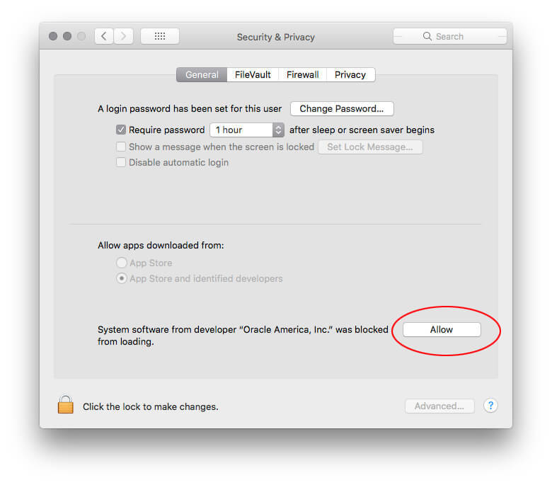

# Common Vagrant Issues

## All Systems

```bash
Vagrant was unable to mount VirtualBox shared folders. This is usually
because the filesystem "vboxsf" is not available. This filesystem is
made available via the VirtualBox Guest Additions and kernel module.
Please verify that these guest additions are properly installed in the
guest. This is not a bug in Vagrant and is usually caused by a faulty
Vagrant box. For context, the command attempted was:

mount -t vboxsf -o dmode=777,fmode=666,uid=1000,gid=1000 var_www /var/www

The error output from the command was:

: No such device
```

Simply run `vagrant reload`

## Mac

### Failed to create the host-only adapter

```
There was an error while executing VBoxManage, a CLI used by Vagrant
for controlling VirtualBox. The command and stderr is shown below.

Command: [“hostonlyif”, “create”]

Stderr: 0%...
Progress state: NS_ERROR_FAILURE
VBoxManage: error: Failed to create the host-only adapter
VBoxManage: error: VBoxNetAdpCtl: Error while adding new interface: failed to open /dev/vboxnetctl: No such file or directory
VBoxManage: error: Details: code NS_ERROR_FAILURE (0x80004005), component HostNetworkInterfaceWrap, interface IHostNetworkInterface
VBoxManage: error: Context: “RTEXITCODE handleCreate(HandlerArg *)” at line 94 of file VBoxManageHostonly.cpp
```

Check Settings > General for `Allow`.



Then restart VirtualBox:

`sudo launchctl load /Library/LaunchDaemons/org.virtualbox.startup.plist`

### Start VM Headless

```
There was an error while executing `VBoxManage`, a CLI used by Vagrant
for controlling VirtualBox. The command and stderr is shown below.

Command: ["startvm", "34aac556-d409-47f6-aad8-af63db5c85b7", "--type", "headless"]

Stderr: VBoxManage: error: The virtual machine 'vagrant-test_default_1612892423317_59961' has terminated unexpectedly during startup with exit code 1 (0x1)
VBoxManage: error: Details: code NS_ERROR_FAILURE (0x80004005), component MachineWrap, interface IMachine
```

See previous issue.

If that doesn't work, uninstall and reinstall VirtualBox.

- [Download latest version](https://www.virtualbox.org/wiki/Downloads) – "OS X hosts"
- Open downloaded image
- Run `bash /Volumes/VirtualBox/VirtualBox_Uninstall.tool` in the terminal
- Restart machine
- Reinstall using the installer on the downloaded image


### failed to create virtualbox object cannot register hard disk

Remove virtual machine in VirtualBox.

Remove disk in: Virtual Media Manager » Hard Disks

## Windows

### Vagrant Version Mismatch

```
Vagrant cannot currently enable access to manage machines within the Windows
environment because the version of Vagrant installed on Windows does not
match this version of Vagrant running within the Windows Subsystem for Linux.
Please ensure both installation of Vagrant are the same. If you do not want
update your Vagrant installations you can disable Windows access by unsetting
the `VAGRANT_WSL_ACCESS_WINDOWS_USER` environment variable.
Windows Vagrant version: 2.2.14
Windows Subsystem for Linux Vagrant version: 2.2.9
```

Just need to install the matching version on Linux (where XXX is the Windows version, e.g. `2.2.14`):

```bash
wget "https://releases.hashicorp.com/vagrant/XXX/vagrant_XXX_x86_64.deb"
sudo dpkg -i "vagrant_XXX_x86_64.deb"
rm "vagrant_XXX_x86_64.deb"
```

### The private key to connect to the machine via SSH must be owned
by the user running Vagrant.

_"The private key to connect to the machine via SSH must be owned
by the user running Vagrant. This is a strict requirement from
SSH itself. Please fix the following key to be owned by the user
running Vagrant:_

_/mnt/c/temp/.vagrant/machines/default/virtualbox/private_key"_

https://github.com/hashicorp/vagrant/issues/8742

Add to `.bash_profile` or `.bashrc`:

`export VAGRANT_WSL_WINDOWS_ACCESS_USER_HOME_PATH="/mnt/c/usr/home/folder"`


**Requires moving .vagrant folder within scope of users home folder**

```bash
mv .vagrant ~/.{project-name}-vagrant
ln -sv ~/.{project-name}-vagrant .vagrant
```

### Misc Issues, SSH times out, or Virtualization not enabled

1. Right-click any space on the taskbar and select Task Manager to open it.
1. Click on the Performance tab.
1. On the right side of CPU tab, you can see Virtualization is Enabled or Disabled.

Follow this guide:

https://www.isumsoft.com/computer/enable-virtualization-technology-vt-x-in-bios-or-uefi.html


### Call to WHvSetupPartition failed

```bash
Stderr: VBoxManage.exe: error: Call to WHvSetupPartition failed: ERROR_SUCCESS (Last=0xc000000d/87) (VERR_NEM_VM_CREATE_FAILED) VBoxManage.exe: error: Details: code E_FAIL (0x80004005), component ConsoleWrap, interface IConsole
```

https://github.com/kubernetes/minikube/issues/4587

RUN > CMD > bcdedit /set hypervisorlaunchtype off then reboot host machine.
