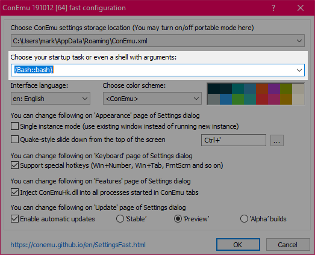

# Setting up Windows

**Make sure you're running the latest version of Windows 10. If you are not then be sure to run the latest updates and restart your machine. If you do not do this some of the steps below may not work. You should *always* keep your operating system and software up to date.**

## Settings

There are a few settings that will make your life much easier:

- Showing hidden files
- Showing file extensions

You can set these by opening Windows Explorer and then click on the "View" tab and choosing "Options -> Change folder and search options". In the list of options choose "Show hidden files, folders and drives" and untick "Hide extensions for known file types".

## Download and install

- [Firefox](https://www.mozilla.org/firefox)
- [Chrome](https://www.google.co.uk/chrome/browser/desktop/index.html): for using ChromeCast
- [Slack](https://slack.com/) our Slack Organisation is `developme` so [developme.slack.com](https://developme.slack.com/)
- [VS Code](https://code.visualstudio.com)
- [Cyberduck](https://cyberduck.io/download/)
- [Vagrant 2.2.6](https://releases.hashicorp.com/vagrant/2.2.6/vagrant_2.2.6_x86_64.msi)
- [Virtualbox 6.0.14](https://download.virtualbox.org/virtualbox/6.0.14/VirtualBox-6.0.14-133895-Win.exe)
- [ConEmu](https://conemu.github.io) - download the "Installer" version

## Photoshop

[Photoshop](http://www.adobe.com/uk/products/photoshop.html) is available as part of [Creative Cloud](https://creative.adobe.com/products/download/creative-cloud) subscription. The first 7 days are free, so if you wait until week 1 to install Photoshop you can get away without a subscription.

## Set up a GitHub account

You can [sign up here](https://github.com/join) (the free plan is fine).

## Setting up Bash for Windows

**Make sure that Vagrant and ConEmu are installed before continuing.**

- Type "developers" into the search bar, then click on "For developers settings"
- In the window that appears select "Developer Mode", then click on "Yes" when prompted
- Type "windows features" into the search bar, then click on "Turn Windows features on or off"
- In the window that appears tick the box named "Windows Subsystem for Linux", then click on "OK"
- Restart your computer

After your computer has restarted, [follow this link to the Windows Store and choose Ubuntu](https://aka.ms/wslstore). Once that is done click on "Launch" and follow the instructions below:

- When prompted, enter a username: this should be all lowercase with no spaces
- When prompted, enter a password: you'll have to type this quite a lot, so pick something memorable (don't worry if it doesn't look like you're typing anything, this is for security) - AND REMEMBER IT, you'll need this later
- Now type `exit`, this will close the Ubuntu app
- Now start ConEmu
- When ConEmu first loads select `{Bash::bash}` as the startup task (If `{Bash:bash}` is not an option then please talk to one of the instructors, otherwise everything else will fail)

    


## Installing command line tools

Make sure you're using ConEmu for all command line interactions from now on - **do not** use the Ubuntu terminal.

- Load ConEmu
- Run:

    ```bash
    curl https://raw.githubusercontent.com/develop-me/bootcamp--setup/master/windows/setup.sh > setup.sh
    ```

- Run:

    ```bash
    bash setup.sh && exit
    ```

- Close ConEmu


**You should use ConEmu for all command line code throughout the course - if you use Git Bash or other command line interfaces you won't have everything you need installed. We suggest pinning ConEmu to the Task Bar - you'll be using it a lot**
