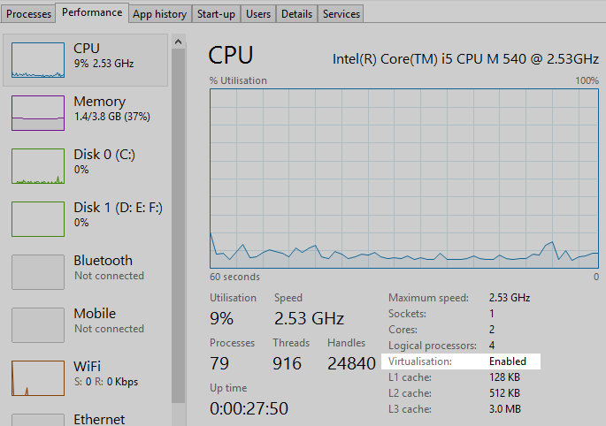
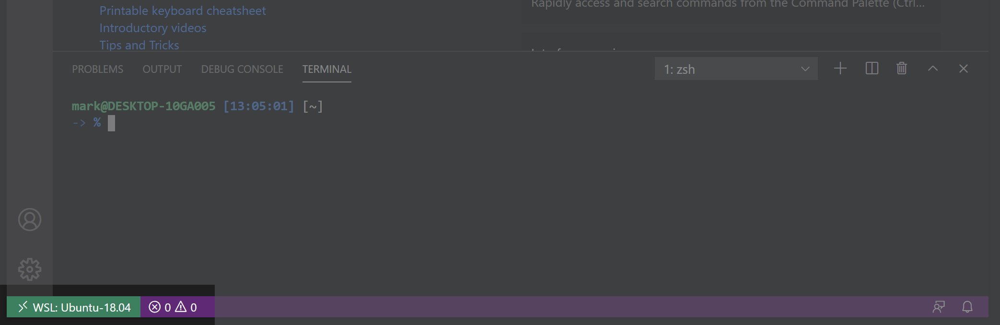
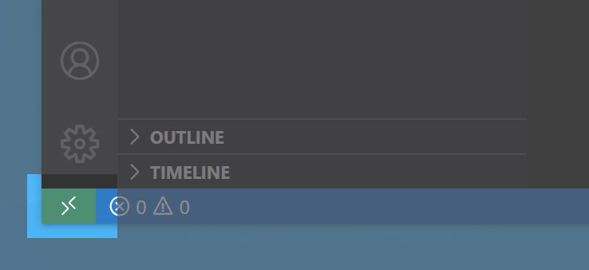

# Setting up Windows

**Make sure you're running the latest version of Windows 10. If you are not then be sure to run the latest updates and restart your machine. If you do not do this some of the steps below may not work. You should *always* keep your operating system and software up to date.**

## Settings

There are a few settings that will make your life much easier:

- Showing hidden files
- Showing file extensions

You can set these by opening Windows Explorer and then click on the "View" tab and choosing "Options -> Change folder and search options". In the list of options choose "Show hidden files, folders and drives" and untick "Hide extensions for known file types".

## Virtualisation

To run Vagrant in the latter part of the course, you'll need to have "Virtualisation" enabled on your machine. You can check if this is turned on by opening "Task Manager" (use Search to find this) and clicking on the "Performance" tab. You should hopefully see "Virtualisation: Enabled":



If Virtualisation is not enabled you will need to [enable it in your BIOS/UEFI](https://www.isumsoft.com/computer/enable-virtualization-technology-vt-x-in-bios-or-uefi.html).


## Virgin Broadband

If you're using Virgin Broadband you will need to [disable "Virus Safe"](https://my.virginmedia.com/my-apps/onlinesecurity/websafe/settings) before running the setup script. Unfortunately they're a bit over-zealous and block *all* GitHub traffic, which probably stops one or two bits of malicious code, but also stops all of the code that we need!


## Download and install

- [VS Code](https://code.visualstudio.com)
- [Firefox](https://www.mozilla.org/firefox)
- [Chrome](https://www.google.co.uk/chrome/browser/desktop/index.html): for using ChromeCast
- [Slack](https://slack.com/) our Slack Organisation is `developme` so [developme.slack.com](https://developme.slack.com/)
- [Cyberduck](https://cyberduck.io/download/)
- [Vagrant 2.2.9](https://releases.hashicorp.com/vagrant/2.2.9/vagrant_2.2.9_x86_64.msi)
- [Virtualbox](https://www.virtualbox.org/wiki/Downloads)


## Setting up Windows Subsystem for Linux (WSL)

**Make sure that Vagrant and VS Code are installed before continuing.**

- Type "developers" into the search bar, then click on "For developers settings"
- In the window that appears select "Developer Mode", then click on "Yes" when prompted
- Type "windows features" into the search bar, then click on "Turn Windows features on or off"
- In the window that appears tick the box named "Windows Subsystem for Linux", then click on "OK"
- Restart your computer

After your computer has restarted, install [Ubuntu 18.04](https://www.microsoft.com/store/productId/9N9TNGVNDL3Q) (Ubuntu 20.04 currently untested). Once that is done click on "Launch" and follow the instructions below:

- You may need to press Enter to kick things off
- When prompted, enter a username: this should be all lowercase with no spaces
- When prompted, enter a password: you'll have to type this quite a lot, so pick something memorable (don't worry if it doesn't look like you're typing anything, this is for security) - AND REMEMBER IT, you'll need this later
- Now, run the setup script:

    ```bash
    bash -c "$(curl -fsSL https://raw.githubusercontent.com/develop-me/bootcamp--setup/master/windows/setup.sh)"
    ```

- You should see "And we're done!" at the end if everything has worked
- Close Ubuntu
- Re-open Ubuntu and type in `weallgood`. You should get a "We all good!" message in response.


## Set up a GitHub account

You can [sign up here](https://github.com/join) (the free plan is fine).

Then reopen the Ubuntu app and run through the [Tooling Choose Your Own Adventure Guide](https://github.com/develop-me/bootcamp--week-05--tooling/blob/master/challenges/00/05-ssh-authentication.md)


## Setting Up VS Code

You should use VS Code's built-in terminal for any command-line work: `Ctrl + Shift + '`

- Open VS Code
- When it first loads it should offer to install the "Remote - WSL" extension. You should install this.
    - If this hasn't happened press `Ctrl + Shift + X` to load the Extensions view and search for "Remote - WSL" and then install it
- Go to `File > Preferences > Settings`. Then click on the small icon of a piece of paper being turned around (top right of the window, left-most icon). Now copy in the [settings](../vscode.json).

### Working with WSL and VS Code

**You need to make sure you always work in WSL Remote mode, otherwise things won't work properly**

Check that you've got the WSL Remote icon in the bottom left corner:



If you haven't:

- Click on the little green symbol in the bottom left corner

    

- Select "Reopen Folder in WSL" if you already have a folder open (or "New Window" if not)

[Some more info about WSL Remote](https://devblogs.microsoft.com/commandline/tips-and-tricks-for-linux-development-with-wsl-and-visual-studio-code/)
